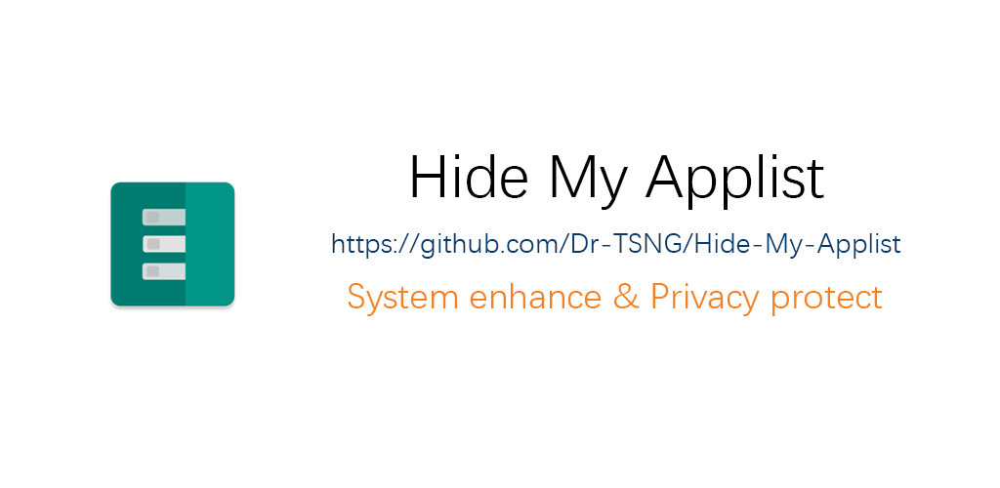

# Hide My Applist

- [English](README.md)  
- 中文（简体）

## 关于该模块
虽然“检测安装的应用”是不正确的做法，但是并不是所有的与 root 相关联的插件类应用都提供了随机包名支持。这就意味着检测到安装了此类应用（如 Fake Location 、存储空间隔离）与检测到了 root 本身区别不大。（会使用检测手段的 app 可不会认为你是在“我就蹭蹭不进去”）  
与此同时，部分“不安分”的应用会使用各种漏洞绕过系统权限来获取你的应用列表，从而对你建立用户画像。（如陈叔叔将安装了 V2Ray 的用户分为一类），或是类似于某某校园某某乐跑的软件会要求你卸载作弊软件。  
该模块提供了一些检测方式用于测试您是否成功地隐藏了某些特定的包名，如 Magisk/Edxposed Manager；同时可作为 Xposed 模块用于隐藏应用列表或特定应用，保护隐私。  

## 更新日志
[参考发布页面](https://github.com/Dr-TSNG/Hide-My-Applist/releases)  
